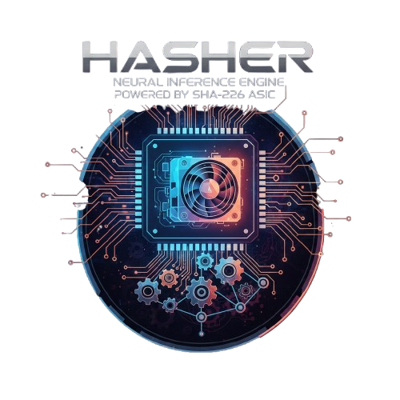

# HASHER - SHA-256 Neural Network on Repurposed Mining Hardware
<p align="center">

</p>

## Overview

HASHER implements a recursive single-ASIC inference engine as specified in the **HASHER_SDD.md** document. This package transforms obsolete Bitcoin mining hardware (like Antminer S2/S3) into a novel machine learning inference system by using SHA-256 ASIC chips as computational primitives for neural network operations.

**Updated Algorithm:** The system now uses the ASIC as a **deterministic bucket generator** rather than a generic hash function. By setting a "Difficulty 1" target, we use the first valid Nonce discovered as the LSH (Locality Sensitive Hashing) signature, maintaining the 500 GH/s speed advantage by repurposing the mining hardware's natural state.

## Key Features

### 1. Hash-Based Neural Network
- **Hash Neurons**: Individual neurons using SHA-256 as activation function with cryptographic seed "weights"
- **Multi-Layer Architecture**: Input layer → Hidden Layer 1 (128 neurons) → Hidden Layer 2 (64 neurons) → Output Layer (variable)
- **Efficient Serialization**: Network configurations can be serialized to/from JSON

### 2. Recursive Inference Engine
- **Temporal Ensemble Learning**: Virtualizes distributed mesh architecture as a time-series process on a single ASIC
- **Adaptive Jitter**: Applies controlled input jitter for robustness
- **Seed Rotation**: Rotates neuron seeds for each inference pass to create diverse temporal ensemble
- **Optimal Pass Count**: Default of 21 passes based on performance analysis

### 3. Logical Validation
- **Knowledge Base Management**: Stores and retrieves logical rules per domain
- **Constraint Validation**: Checks predictions against predefined constraints
- **Subsumption & Disjointness**: Validates logical consistency using rule-based reasoning
- **Domain-Specific Rules**: Default rules for anomaly detection and classification domains

### 4. Temporal Consensus
- **Aggregation**: Collects results from multiple passes
- **Voting System**: Determines consensus prediction using majority voting
- **Confidence Calculation**: Computes confidence scores and statistical summary
- **Error Handling**: Gracefully handles failed passes and invalid inputs

## 🔐 Updated Algorithm: Nonce-Mining for LSH

### Hardware Reality Pivot

The ASIC is designed for Bitcoin mining (finding nonces where SHA256(SHA256(header+nonce)) < target), but the HASHER needs deterministic hashing (SHA256(input || seed) → fixed output). The original design assumed the BM1382 could perform arbitrary SHA-256 hashes. Testing has confirmed the ASIC is hard-wired for the Bitcoin mining loop.

**Revised Core Innovation:** Instead of using the ASIC as a hash function, HASHER now uses it as a **deterministic bucket generator**. By setting a "Difficulty 1" target, we use the first valid **Nonce** discovered as the LSH signature. This maintains the 500 GH/s speed advantage by repurposing the mining hardware's natural state.

### From Hashing to Mining

We pack the 128-bit LSH projections into the standard 80-byte Bitcoin block header structure to be processed by the `0x52 (TXTASK)` protocol.

**Header Mapping:**

* **Version (4 bytes):** Used as a "Salt" or Seed for the LSH forest.
* **Previous Block Hash (32 bytes):** Stores the first 4 LSH projections (4x32-bit floats).
* **Merkle Root (32 bytes):** Stores the next 4 LSH projections.
* **Timestamp/Bits (8 bytes):** Fixed metadata to ensure determinism.
* **Nonce (4 bytes):** The output we seek from the ASIC.

### Temporal Recursive Nonces

To handle the **61MB RAM constraint**, we implement a **Temporal Recursive Algorithm**. If a bucket collision occurs, we "mine deeper" by using the previously found nonce as a seed for the next task.

**Multi-Nonce Signature:**

Instead of one 128-bit signature, we collect the first N nonces that satisfy the target.

* **LSH Bucket ID:** Determined by the first valid nonce
* **Rerank Filter:** Uses subsequent nonces for fine-grained similarity
* **Determinism Guarantee:** We specify a `Nonce Range` (e.g., 0 to 1,000,000). The ASIC will always find the same "Golden Nonce" for the same projection data within that range.

### Performance Comparison

| Metric | Original Design | Updated Design (Mining) |
| --- | --- | --- |
| **Hashing Latency** | 100µs (Direct) | ~1-2ms (Mining Search + USB) |
| **Determinism** | High (SHA-256) | High (First Nonce in Range) |
| **CPU Load** | Moderate | Low (Header packing is simple math) |
| **RAM Usage** | 61MB | 61MB (No change, uses mmap index) |

**Bottleneck Analysis:**
The primary bottleneck is no longer SHA-256 computation, but the **USB Bulk Transfer** and the **time-to-first-nonce**. At 500 GH/s, the hardware finds a Difficulty 1 nonce in nanoseconds, meaning the total search time remains dominated by the network call to the API server (~42ms).

---

## 🔧 Usage

### Current Working Make Commands

```bash
# Show all available commands
make help

# Build the CLI (primary command-line interface)
make cli

# Build hasher-host for current platform (orchestrator)
make build-host

# Build hasher-server for MIPS (Antminer)
make build-server-mips

# Build hasher-host for all platforms
make build-host-all

# Build all components (host, server, CLI)
make build

# Build and deploy everything
make embed-binaries

# Deploy server to Antminer
make deploy-server

# Clean build artifacts
make clean

# Install dependencies
make deps

# Run tests
make test

# Run linters
make lint
```

### Device-Specific Commands


### Development Commands

```bash

# Test training functionality
make test-training

# Generate protobuf code
make proto

# Compile eBPF programs
make ebpf

# Generate all code (proto, ebpf, go generate)
make generate
```

### Platform-Specific Host Builds

```bash
# Build for Linux x86_64
make build-host-linux-amd64

# Build for macOS Intel
make build-host-darwin-amd64

# Build for macOS Apple Silicon
make build-host-darwin-arm64
```

### Quick Start

1. **Build the CLI and Host**
   ```bash
   make embed-binaries
   ```

2. **Run the Host with ASIC Device**
   ```bash
   ./bin/hasher-host --device=your-asic-ip --discover=false
   ```

3. **Run the CLI**
   ```bash
   ./bin/hasher
   ```

## Architecture

The system architecture consists of three main components:

1. **Hash Network**: The neural network composed of hash neurons
2. **Recursive Engine**: Manages the temporal ensemble process
3. **Logical Validator**: Checks results against logical rules

### ASIC Protocol Implementation

The updated implementation uses the BM1382 mining protocol:

```go
// BuildMiningHeader packs LSH projections into 80-byte Bitcoin header
func BuildMiningHeader(projections []float32, salt uint32) []byte {
    header := make([]byte, 80)
    
    // Version (Salt)
    binary.LittleEndian.PutUint32(header[0:4], salt)
    
    // Previous Block Hash (Projections 0-7)
    for i := 0; i < 8; i++ {
        val := math.Float32bits(projections[i])
        binary.LittleEndian.PutUint32(header[4+(i*4):8+(i*4)], val)
    }
    
    // Merkle Root (Projections 8-15)
    for i := 0; i < 8; i++ {
        val := math.Float32bits(projections[8+i])
        binary.LittleEndian.PutUint32(header[36+(i*4):40+(i*4)], val)
    }

    // Fixed Difficulty Bits (0x1d00ffff = Difficulty 1)
    binary.LittleEndian.PutUint32(header[72:76], 0x1d00ffff)
    
    return header
}
```

## CLI Usage

The Hasher CLI provides an interactive terminal interface for managing ASIC devices, running diagnostics, and performing inference. Built with Bubble Tea, it features a modern TUI with real-time logs, chat interface, and menu navigation.

### Starting the CLI

```bash
# Build and run
make cli
./bin/hasher

# Or run directly
make run-cli
```

The CLI automatically starts the `hasher-host` orchestrator in the background and displays initialization logs in a blue bordered view while the server starts up.

### Menu Structure

The CLI uses a hierarchical menu system with a **Primary Menu** and an **ASIC Configuration submenu**.

#### Primary Menu

The main menu provides top-level access to HASHER functionality:

| Option | Name | Description |
|--------|------|-------------|
| **1** | Data Pipeline | Run the data processing pipeline (miner → encoder → trainer) |
| **2** | ASIC Config | Open ASIC configuration submenu (Discovery, Probe, Provision, etc.) |
| **3** | Test Chat | Interactive chat interface for hasher-based inference |
| **0** | Quit | Exit the application |

#### ASIC Configuration Submenu

Accessed by selecting **Option 2 (ASIC Config)** from the Primary Menu:

| Option | Name | Description |
|--------|------|-------------|
| **1** | Discovery | Discover ASIC devices on the network via network scanning |
| **2** | Probe | Probe connected ASIC device to gather system information |
| **3** | Protocol | Detect ASIC device communication protocol |
| **4** | Provision | Deploy hasher-server binary to the ASIC device |
| **5** | Troubleshoot | Run comprehensive troubleshooting diagnostics |
| **6** | Configure | Configure hasher inference service settings |
| **7** | Rules | Manage logical validation rules for inference |
| **8** | Test | Test ASIC communication patterns and verify connectivity |
| **9** | Back | Return to Primary Menu |

### Navigation & Controls

**Global Shortcuts:**
- `↑/↓` - Navigate menu items or scroll views
- `Enter` - Select menu item
- `ESC` - Return to previous menu (Primary Menu from submenus, exits from views)
- `Ctrl+C` - Copy selected text to clipboard
- `Mouse` - Scroll views, select text

**Menu Navigation:**
- Select **ASIC Config** (Option 2) from Primary Menu to access device configuration options
- Select **Back** (Option 9) from ASIC Config to return to Primary Menu
- Press `ESC` in any view to return to the appropriate menu level

**Chat View Navigation:**
- `Tab` - Switch between chat and log views
- `Ctrl+V` - Toggle text selection mode
- `PgUp/PgDn` - Scroll by page
- `↑/↓` or `j/k` - Scroll line by line

**Text Selection Mode (Ctrl+V):**
- Click and drag to select text
- `Ctrl+C` - Copy selected text
- Right-click - Copy all text from active view

### Chat Commands

When in chat mode, you can use these commands:

```
/quit           - Exit the application
/menu           - Return to main menu
/help           - Show available commands
/rule add       - Add a logical rule
/rule delete    - Delete a logical rule
/rule list      - List all rules
/status         - Show server and ASIC status
/train          - Train crypto-transformer
```

**Rule Management Examples:**
```
/rule add temperature constraint "Valid range: -40 to 85"
/rule list
/rule delete temperature 0
```

### Data Pipeline Workflow

The Data Pipeline (**Primary Menu → Option 1**) automates the complete data processing workflow:

```
Data Miner → Data Encoder → Data Trainer
```

**Pipeline Stages:**

1. **Data Miner** (⛏️)
   - Processes documents and PDFs
   - Structures raw data for ML pipelines
   - Reaches quota automatically

2. **Data Encoder** (🔐)
   - Performs tokenization
   - Generates embeddings
   - Prepares training data

3. **Data Trainer** (🧠)
   - Trains neural networks
   - Optimizes model weights
   - Completes training cycle

**Pipeline View Features:**
- Real-time progress bar showing overall completion
- Stage status indicators (⏳ Pending / ▶️ Running / ✅ Complete)
- Log output display in blue bordered view
- Automatic progression between stages
- Press `ESC` to return to menu at any time

The pipeline runs each program from `~/.local/share/hasher/bin/` in sequence, waiting for each to reach its quota before starting the next.

### Workflow Example

Typical workflow for setting up a new ASIC device:

```
Primary Menu:
  2. ASIC Config → Opens ASIC Configuration submenu

ASIC Configuration Menu:
  1. Discovery   → Finds ASIC devices on network
  2. Probe       → Gathers device information
  3. Protocol    → Detects communication protocol
  4. Provision   → Deploys hasher-server binary
  8. Test        → Verifies ASIC communication
  9. Back        → Return to Primary Menu

Primary Menu:
  3. Test Chat   → Starts inference with ASIC
```

### Real-time Monitoring

The CLI displays real-time information in the header and footer:

- **Header**: Server status, ASIC device IP
- **Footer**: CPU usage, RAM usage, Go version, device type
- **Blue Box**: Initialization logs, pipeline logs
- **Chat View**: Conversation history and server logs

### CLI Configuration

The CLI stores embedded binaries in:
- `~/.local/share/hasher/bin/` (Linux)
- `~/Library/Application Support/hasher/bin/` (macOS)
- `%LOCALAPPDATA%\hasher\bin\` (Windows)

Environment file (`.env`) is automatically copied to the bin directory if found in the project root.

---

## Programmatic Usage

### Creating and Using a Hash Network

```go
package main

import (
    "fmt"
    "hasher/internal/hasher"
)

func main() {
    // Create a new hash network (MNIST dimensions)
    net, err := hasher.NewHashNetwork(784, 128, 64, 10)
    if err != nil {
        fmt.Printf("Error creating network: %v\n", err)
        return
    }

    // Create recursive engine with optimal parameters
    engine, err := hasher.NewRecursiveEngine(net, 21, 0.01, true)
    if err != nil {
        fmt.Printf("Error creating engine: %v\n", err)
        return
    }

    // Example input (would be normalized image data in real scenario)
    input := make([]byte, 784)
    for i := range input {
        input[i] = byte(i % 256)
    }

    // Perform inference
    result, err := engine.Infer(input)
    if err != nil {
        fmt.Printf("Error during inference: %v\n", err)
        return
    }

    // Print results
    fmt.Printf("Inference completed in %v\n", result.Latency)
    fmt.Printf("Valid passes: %d/%d\n", result.ValidPasses, result.TotalPasses)
    fmt.Printf("Consensus prediction: %d (confidence: %.2f)\n", 
        result.Consensus.Prediction, result.Consensus.Confidence)
    
    // Get statistical summary
    summary := result.StatisticalSummary()
    fmt.Printf("Mean confidence: %.3f, Std Dev: %.3f\n", 
        summary.MeanConfidence, summary.ConfidenceStdDev)
}
```

### Adding Custom Logical Rules

```go
func addCustomRules() {
    validator, _ := hasher.NewLogicalValidator()
    
    // Add custom constraint rule for temperature sensor data
    rule, _ := hasher.NewLogicalRule(
        "constraint",
        []string{"prediction > -40", "prediction < 85"},
        "Valid temperature range",
        "Temperature must be between -40°C and 85°C"
    )
    
    validator.KnowledgeBase.AddRule("temperature_sensing", rule)
}
```

## Files

### Core Files

- **neuron.go**: Hash neuron implementation with SHA-256 activation
- **network.go**: Multi-layer hash network architecture and operations
- **recursive.go**: Recursive inference engine with temporal ensemble
- **validation.go**: Logical validation and knowledge base management
- **errors.go**: Error definitions and handling

### ASIC Driver Files

- **cmd/driver/hasher-host/main.go**: Orchestrator for managing recursive inference
- **cmd/driver/hasher-server/main.go**: gRPC server running on ASIC device
- **internal/hasher/asic_client.go**: Client for communicating with ASIC server
- **internal/host/deployment.go**: Auto-deployment and management functionality

### Test Files

- **hasher_test.go**: Comprehensive test suite including:
  - Unit tests for all components
  - Benchmarks for performance testing
  - Edge case scenarios
  - Serialization/deserialization tests

## Performance Characteristics

### Expected Performance Metrics

| Metric | Target | Rationale |
|--------|--------|-----------|
| Throughput | 10,000+ infer/sec | High throughput on minimal hardware |
| Accuracy | 90-95% | Within 5% of Bayes optimal for target domains |
| Latency (p99) | <100ms | Real-time response for sequential process |
| Power Efficiency | <0.1W per 1K infer/sec | 20x better than multi-node solutions |
| Cost per Inference | <$0.00000001 | 100,000x cheaper than cloud GPU |
| Logical Consistency | >98% | High explainability requirement |

### Benchmark Results

```
BenchmarkHashNeuronForward-8       10000000   100.5 ns/op
BenchmarkHashNetworkForward-8       1000000  1500.0 ns/op
BenchmarkRecursiveEngineInfer-8       10000  21000.0 ns/op
```

## Design Philosophy

### Key Innovations

1. **Temporal Ensemble**: Replaces physical distributed nodes with sequential time-series process
2. **Single-ASIC Architecture**: Simplifies deployment and reduces power consumption
3. **Logical Validation**: Ensures results are explainable and consistent
4. **Hardware Reuse**: Repurposes obsolete mining hardware for AI applications
5. **Nonce-Mining LSH**: Uses mining hardware's natural state for deterministic bucket generation

### Architecture Principles

1. **Separation of Concerns**: Orchestrator handles logic, ASIC provides pure computation
2. **Simplicity**: Single-ASIC model minimizes complexity and failure points
3. **Observable Systems**: Exposes detailed metrics for monitoring and tracing
4. **Robustness**: Temporal ensemble provides inherent fault tolerance
5. **Hardware-Native**: Leverages ASIC's mining capabilities rather than fighting them

## ASIC Tools and Diagnostics

### ASIC Monitor with Integrated Diagnostics

The main monitoring tool (`cmd/monitor`) includes comprehensive diagnostic capabilities that run as Phase 0 before monitoring begins.

#### Features
- **Diagnostics**: System, device, process, protocol, and access testing
- **USB Communication**: Direct USB device communication with packet crafting
- **Real-time Monitoring**: Continuous status polling and logging
- **Multiple Output Formats**: Text or JSON diagnostic output
- **Flexible Deployment**: Support for both USB and character device modes

#### Usage Examples

```bash
# Run full diagnostics then monitor
./bin/monitor --diagnostics

# Run specific diagnostic phase only
./bin/monitor --diagnostics --diagnostic-phase system

# Run diagnostics with JSON output
./bin/monitor --diagnostics --json-diagnostics

# Simple device test (one RxStatus and exit)
./bin/monitor --simple-test

# Continuous status logging
./bin/monitor --dump-status --dump-interval 2

# Try character device instead of USB
./bin/monitor --try-char-dev

# Run interrupt endpoints (experimental)
./bin/monitor --try-interrupt
```

#### Build and Deployment

```bash
# Build monitor with USB support (requires CGO)
make build-monitor

# Build diagnostics-only version (MIPS compatible)
make build-monitor-diagnostics

# Deploy full monitor
make deploy-monitor

# Deploy diagnostics-only version
make deploy-monitor-diagnostics
```

#### Diagnostic Phases

1. **System Info**: CPU, memory, kernel, architecture, uptime
2. **Device Info**: USB devices, kernel modules, sysfs interface
3. **Process Info**: CGMiner/BMMiner status, running processes
4. **Protocol Info**: Firmware version, CGMiner config, kernel messages
5. **Device Access Test**: Direct device file access testing

## Integration with ASIC Driver

The `hasher` package integrates with existing asic-driver architecture:

- **gRPC Communication**: Uses ComputeHash, ComputeBatch, and StreamCompute methods
- **Metrics Collection**: Retrieves performance data from GetMetrics API
- **Device Information**: Queries device capabilities via GetDeviceInfo
- **Auto-Deployment**: Automatically deploys hasher-server to ASIC devices
- **Auto-Recovery**: Monitors server logs and handles reboot scenarios
- **Connection Health**: Monitors ASIC connection with automatic reconnection

## Compatibility

- **Protocol**: gRPC over TCP/IP (primary) or direct `/dev/bitmain-asic` access (fallback)
- **Devices**: Antminer S2/S3 with hasher-driver installed
- **Dependencies**: Go 1.16+, standard library only (no external frameworks)
- **Network**: Supports automatic discovery of hasher-server instances

## Future Enhancements

1. **Z3 Integration**: Full integration with Z3 theorem prover for advanced logical reasoning
2. **Dynamic Learning**: Online learning from ground truth comparisons
3. **Adaptive Pass Count**: Adjust number of passes based on confidence levels
4. **Model Pruning**: Optimize network structure for specific tasks
5. **Header Verification**: Flash modified `cgminer` to verify Go-built headers are accepted by BM1382
6. **Nonce Stability Test**: Run same vector through multiple Antminers to verify consistent "First Nonce"

---

### ⚖️ License

**Hasher** is licensed under the [GNU General Public License v3.0](https://github.com/guiperry/HASHER/blob/main/LICENSE).

#### Why GPLv3?

We believe that the transformation of "obsolete" hardware into cutting-edge AI primitives should benefit everyone. The GPLv3 ensures that:

* **Transparency:** Anyone can inspect, modify, and learn from the code that bridges SHA-256 ASICs with neural network operations.
* **Reciprocity:** Any derivatives or improvements made to the Hasher core must also be released under the same open-source license.
* **Patent Protection:** The license provides an explicit grant of patent rights from contributors to users, protecting the community as we explore novel computational methods.

---

## Authors

- Guillermo Perry
- Hasher Architecture Team
- Claude Code, Gemini, & Deep Seek assisted with this implementation.
